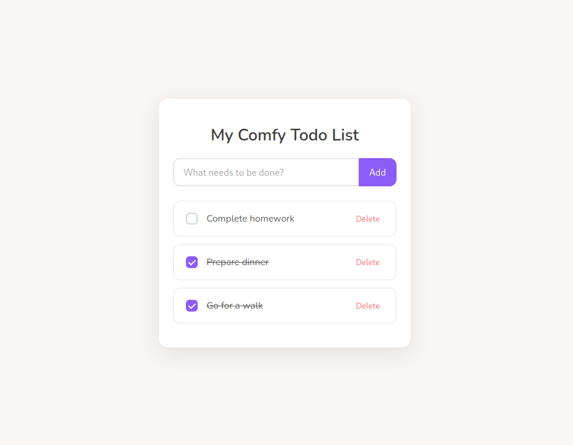

# Todo App

A simple, modular Todo application built with TypeScript, HTML and CSS. Designed with clean separation of concerns using services, views, and handlers.

### Features

- Add, toggle, delete, and edit todos
- Data persisted in `localStorage`
- Modular code structure for better scalability

### Tech Stack

- TypeScript
- HTML/CSS
- Vite



## How to run

```bash
git clone https://github.com/saadfrhan/todo-app-js
cd todo-app-js
pnpm i
pnpm dev
```

Now open your browser and go to `http://localhost:5173`.
